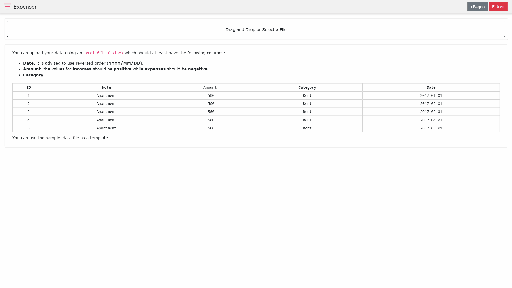

# Expenses Visualization App (ExpensOR)
[](https://travis-ci.com/villoro/expensor)
[](https://codecov.io/gh/villoro/expensor)

This is a [dash](https://plot.ly/products/dash/) app that allows users to visualitze their expenses and/or incomes.



## Usage
You can upload your data using an ```Excel file (.xlsx)``` which should at least have 3 sheets:
* **liquid_list**
* **liquid_m**
* **trans_m**

All columns names **MUST** be exactly equal as the examples below. You can use the [sample_data](https://github.com/villoro/expensor/blob/master/sample_data/data.xlsx) file as a template

For all the  dates columns is better to use reversed order (**YYYY/MM/DD**).

### liquid_list
This sheet should be a list of all accounts where you store liquid. It should have these three columns:
* **Name:** name of the account
* **Liquidity level:** this level states how easy it is to get that money (low levels mean easy)
* **Liquidity name:** name to be used for that level

| Name                  | Liquidity level | Liquidity name       |
|-----------------------|-----------------|----------------------|
| Personal bank account | 0               | Liquid               |
|  Shared bank account  | 0               | Liquid               |
|      Bank deposit     | 1               | Deposit              |
| Bank 2 deposit        | 1               | Potencial investment |
| Robinhood uninvested  | 2               | Potencial investment |

### liquid_m
In this sheet the program is expecting a **Date** column and one column for each account in the ```liquid_list``` sheet.

| Date    | Total   | Personal bank account | Shared bank account |Bank deposit | Bank 2 deposit | Robinhood uninvested |
|---------|---------|-----------------------|---------------------|-------------|----------------|----------------------|
| 01/2017 | 5366,00 | 1438                  |                     |             | 2000           | 1665                 |
| 02/2017 | 6238,00 | 1341                  | 666                 |             | 2000           | 1779                 |
| 03/2017 | 5463,00 | 1338                  | 221                 | 1000        | 1000           | 1435                 |
| 04/2017 | 5850,00 | 1432                  | 440                 | 1500        | 1000           | 1150                 |
| 05/2017 | 6916,00 | 1571                  | 878                 | 2000        | 1000           | 987                  |
| 06/2017 | 4216,00 | 1268                  | 690                 | 500         | 500            | 823                  |

### trans_m
This sheet should at least have the following columns:

| Date       | Amount | Category |
|------------|--------|----------|
| 2017/01/01 | -500   | Rent     |
| 2017/02/01 | -500   | Rent     |
| 2017/03/01 | -500   | Rent     |
| 2017/01/01 | 1150   | Salary   |
| 2017/02/01 | 1250   | Salary   |

It is important to notice that **incomes** have **positive** amount while **expenses** are **negative**.

## Install
1. Download the code 

    ```git clone https://github.com/villoro/expensor.git```

2. Install requirements

    ```pip install -r requirements.txt```
    
3. Run the app

    ```
    cd src
    python index.py
    ```
    
__* Note:__ The app is only tested in **python 3**. It might not work with python 2. 

## Authors
* [Arnau Villoro](villoro.com)

## License
The content of this repository is licensed under a [MIT](https://opensource.org/licenses/MIT).

## Nomenclature
Branches and commits use some prefixes to keep everything better organized.

### Branches
* **f/:** features
* **r/:** releases
* **h/:** hotfixs

### Commits
* **[NEW]** new features
* **[FIX]** fixes
* **[REF]** refactors
* **[PYL]** [pylint](https://www.pylint.org/) improvements
* **[TST]** tests